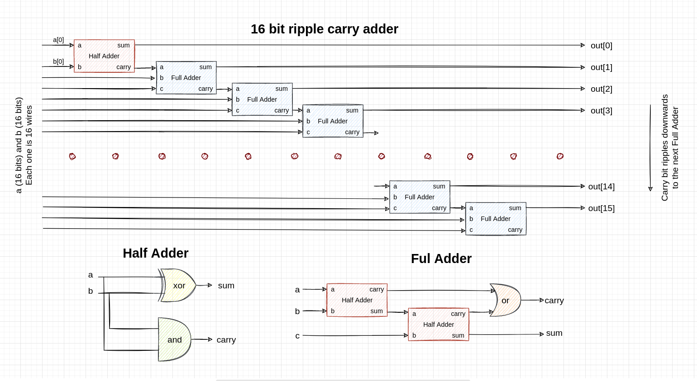
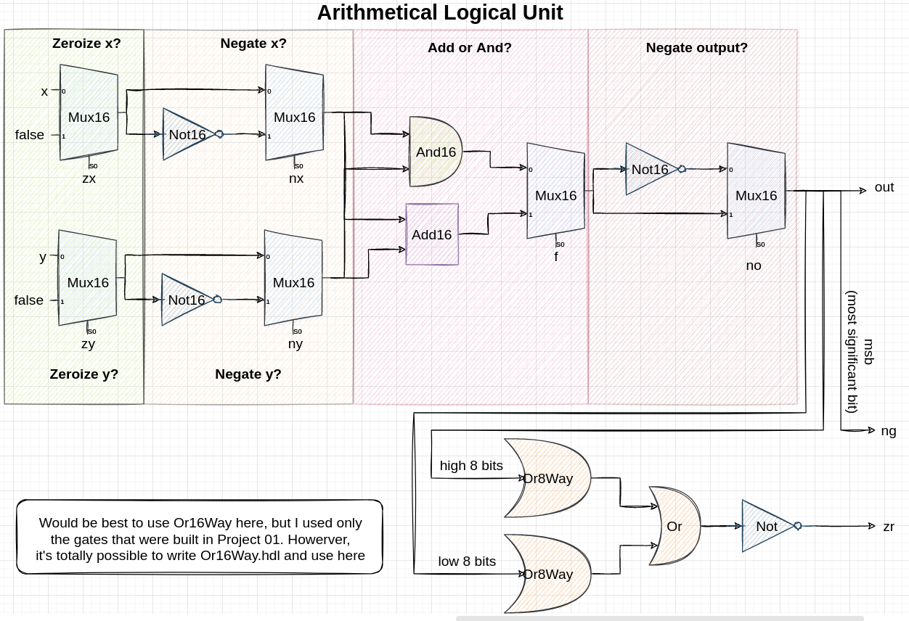

## Adders

Core adder gates are implemented as in the picture below:

## Arithmetical logical unit

Called so because it can perform arithmetical (+, -) and logical (&, |, ~) operations. Basic scheme is described below:

