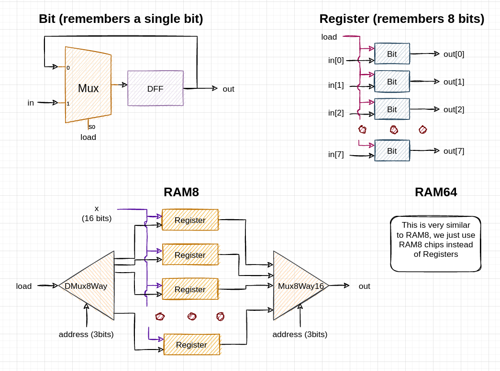

## Flip-Flops

A nice DIY tryout with latches and flip-flops:
* [How Do Computers Remember?](https://youtu.be/I0-izyq6q5s)

Recommended videos about flip-flops and clock:
* [How Flip Flops Work - The Learning Circuit](https://youtu.be/Hi7rK0hZnfc)
* [What is a D Flip-Flop? FPGA concepts](https://youtu.be/8Rbg-pm8LiE)

## Basic memory chips

Implemented like this:

The rest of the memory chips of higher order are implemented in the similar manner.

We use demultiplexer to send the `load` bit to its destination according to the provided `address`, and we wire the 16-bit input value to all of the memory elements of the chip. One of them will store this value (if `load` is set to HIGH) while all the other memory elements will simply ignore the input value because they will necessarily receive 0 on their `load` input. 

After that we use multiplexer to get values from all the memory elements in the chip, and we'll ignore all the values except for the one that comes from one certain memory element - as defined by the `address` input.
