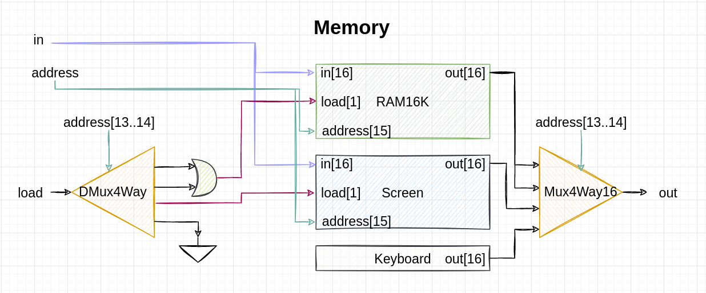
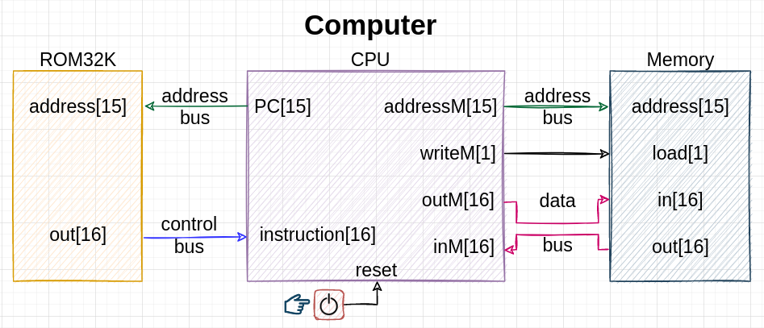
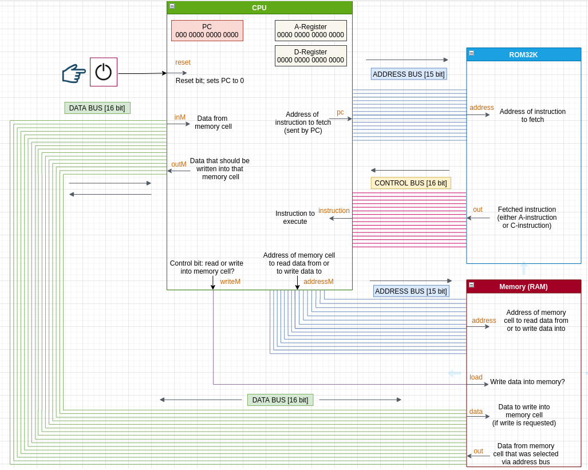

## Memory

Rather straightforward:

- Address bits 13 and 14 are telling us all that we need to know about load destination (where to write data to, if write is needed), and where to fetch data from (RAM, Screen or Keyboard chip).
- Note that this architecture relies on the assumption that a load signal will never be on 1 when addressing the keyboard; this allows to use DMux instead of DMux 4 way in Step 1. There's no sense in setting load to HIGH for keyboard, because we never write anything to the Keyboard chip. Thus, even when bits 13 and 14 are HIGH (meaning that we address the Keyboard chip and not Screen!), Screen module will still get load = 0 and its data won't be changed, because load is set to LOW when we address keyboard (that's our assumption).

## Computer

Implemented as follows:

- Each bus is a collection of 15 (address) or 16 (control, data) wires. So 15 or 16 bits can be passed through these buses simultaneously; this number is called **bus width**.
- IRL a different architecture is common: address bus is used to address RAM / ROM, data bus is used for getting both data and instructions, and [control bus](https://en.wikipedia.org/wiki/Control_bus) has signal wires on it - like WR (write signal), RD (read signal), or others like IORQ (I/O request), MEMRQ (memory request), etc.
- Address bus works only in one way - from CPU to RAM/ROM. Contrary to that, data bus works in both ways, so sometimes CPU is source and memory is destination, and sometimes memory is source and CPU is destination. 
- Width of data bus is what they mean when they say "this is a 32bit CPU" or "this is a 64bit CPU". That's a maximum size (in bits) of data that CPU can receive or transmit at a given moment.
- However, when they say "32bit OS" or "64 bit OS" - that typically means the amount of addresses reachable by that particular OS. While 32bit OS technically can reach 2^32 addresses, the 64bit one can work with 2^64 addresses.
- Hack is a "one-cycle, two-memory machine" (the so-called Harvard architecture), which requires two separate memory chips - RAM and ROM. But most modern CPUs are 3-cycle one-memory machines, i.e. they are capable of storing both data and instructions in RAM, but in turn they need more CPU cycles to perform operations.
- Hack CPU is described as a device that uses the "fetch - execute" sequence, whereas other CPUs have the explicit "decode" phase: "fetch - decode - execute", where the decoding phase is the phase when control unit sets up all the necessary control bits - like CPU control bits, registers load bits, memory load bit, etc. - before execution of the instruction itself. Control unit "sets things up", i.e. prepares registers and ALU; only after that does the actual instruction get executed.
- Modern CPUs use advanced techniques to boost their performance and eliminate bottlenecks - like memory caching, instruction pipelining, out-of-order execution, etc.
- In modern CPUs, all memory modules (like several RAM chips, each with 2GB, totalling in 8GB RAM) are usually sitting on the same data bus and address bus. In this case, each chip "knows" that it's the one that is addressed by getting a signal - RD, WR or CS ("chip select", the so-called third state, or disconnected state, or high impedance state, or hi-Z state) via control bus. Decoder (with some simple inverter logic) sends appropriate signals - read, write, or chip_select - to appropriate RAM chip.
A bit more detailed scheme:

