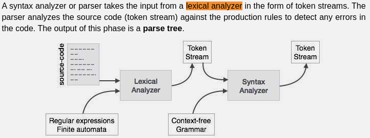

## Implementation details

**Note**: this implementation of compiler is different from the one proposed in the course, to be shorter and faster to write. Though the main idea is the same, of course.

 * `lexer.py` - another name for a tokenizer. "Scanner", "lexer", "tokenizer", "lexical analyzer" mean basically the same thing. 
    Implementation is different from the book's proposed approach, as I used regular expressions and string manipulations to get the job done. 
 * `parser.py` - parser, which builds parse tree. In the book this is called "compiler", but since all it does is building a parse tree (i.e. it doesn't really do any compilation/optimizations) I called it "parser" instead of "compiler". It also follows the "lexer + parser" pair, like lex + yacc. Similarly, its methods are called `_parse_XXX` instead of `_compile_XXX`, but the essence is the same. 
    Parser is implemented in a similar way to what the book proposes.

Note that another name for lexer is "lexical analyzer" and for parser it's "syntax analyzer".

### Building a parser
While building a lexer is very straightforward, building a parser is a more complex task.
* I recommend not to start from high-level methods like `compileClass` or `compileSubroutineDec`, but from low-level methods; start from building a term processing method (`compileTerm` in the book).
* Make it work with the simplest terms. Then, on a certain stage, you'll need to implement `compileExpression` method, which invokes `compileTerm` by the way. So, do it, and move on like this - all the way up to `compileClass`.
* Try to gradually test each new piece of functionality that you add to `compileTerm`. When I was building the parser, this is exactly what I did - wrote tests for various cases, where the expected output was taken from course XML files, and the actual output was produced by the functions that I implemented. A test is passed when expected and actual outputs do match. 

### Statements and expressions
Loosely speaking, expression is something that evaluates to a value, like `x+1`, `2+2` or `foo() + bar()`; statements are the smallest standalone element of an imperative programming language. A program is formed by a sequence of one or more statements. A statement will have internal components (e.g., expressions) - from Wiki. 
In Jack language statements are "let statement", "if statement", "while statement", "do statement" and "return statement".