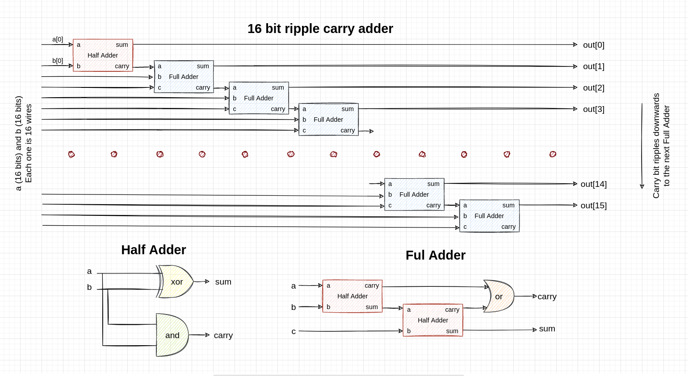
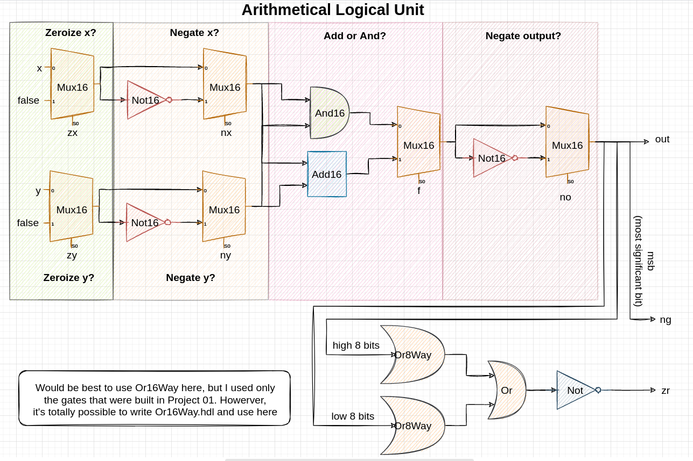

## Adders

Core adder gates are implemented as in the picture below:

## Arithmetical logical unit

Called so because it can perform arithmetical (+, -) and logical (&, |, ~) operations. Basic scheme is described below:

## Falstad

Falstad link: https://tinyurl.com/289cnrql

The simulator struggles to work with this one (ALU is really heavy, even when placed into its own circuit file), so the simulation lags. If you change the inputs to ALU, you'll need to wait up to several seconds for the changes to actually take place.