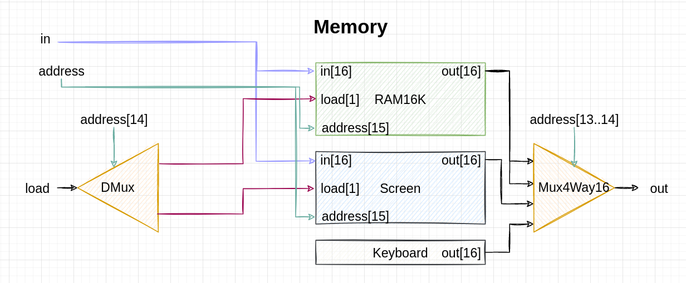
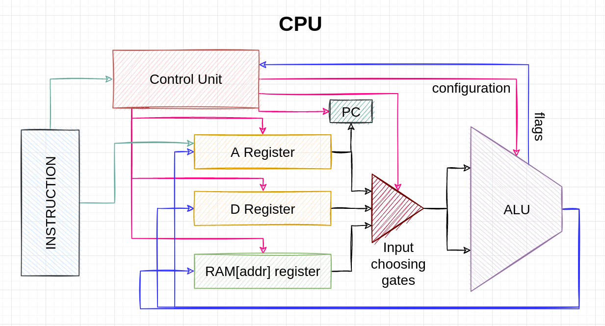

## Memory

Rather straightforward:

- Address bits 13 and 14 are telling us all that we need to know about load destination (where to write data to, if write is needed), and where to fetch data from (RAM, Screen or Keyboard chip).
- Note that this architecture relies on the assumption that a load signal will never be on 1 when addressing the keyboard; this allows to use DMux instead of DMux 4 way in Step 1. There's no sense in setting load to HIGH for keyboard, because we never write anything to the Keyboard chip. Thus, even when bits 13 and 14 are HIGH (meaning that we address the Keyboard chip and not Screen!), Screen module will still get load = 0 and its data won't be changed, because load is set to LOW when we address keyboard (that's our assumption).

&nbsp;&nbsp;&nbsp;
## Computer

Implemented as follows:

- Each bus is a collection of 15 (address) or 16 (control, data) wires. So 15 or 16 bits can be passed through these buses simultaneously; this number is called **bus width**.
- IRL a different architecture is common: address bus is used to address RAM / ROM, data bus is used for getting both data and instructions, and [control bus](https://en.wikipedia.org/wiki/Control_bus) has signal wires on it - like WR (write signal), RD (read signal), or others like IORQ (I/O request), MEMRQ (memory request), etc.
- Address bus works only in one way - from CPU to RAM/ROM. Contrary to that, data bus works in both ways, so sometimes CPU is source and memory is destination, and sometimes memory is source and CPU is destination. 
- Width of data bus is what they mean when they say "this is a 32bit CPU" or "this is a 64bit CPU". That's a maximum size (in bits) of data that CPU can receive or transmit at a given moment.
- However, when they say "32bit OS" or "64 bit OS" - that typically means the amount of addresses reachable by that particular OS. While 32bit OS technically can reach 2^32 addresses, the 64bit one can work with 2^64 addresses.
- Hack is a "one-cycle, two-memory machine", which requires two separate memory storages - RAM and ROM (the so-called Harvard architecture). But many modern CPUs are 3-cycle one-memory machines, i.e. they are capable of storing both data and instructions in RAM, though in turn they need more CPU cycles to perform operations.
- Hack is designed as a Harvard architecture machine, that is - with separate ROM and RAM. Von Neumann machines would use one storage for both instructions and data. Today, microcontrollers are usually built with Harvard architecture, having a small ROM and a flash SRAM or something of this sort. "Regular" computers typically use a "hybrid" of von Neumann and Harvard architectures - the "modified Harvard architecture".  
- Hack CPU is described as a device that uses the "fetch - execute" sequence, whereas other CPUs have the explicit "decode" phase: "fetch - decode - execute", where the decoding phase is the phase when control unit sets up all the necessary control bits - like CPU control bits, registers load bits, memory load bit, etc. - before execution of the instruction itself. Control unit "sets things up", i.e. prepares registers and ALU; only after that does the actual instruction get executed.
- Modern CPUs use advanced techniques to boost their performance and eliminate bottlenecks - like _memory caching_, _instruction pipelining_, _out-of-order execution_, etc.
- In modern CPUs, all memory modules (like several RAM chips, each with 2GB, totalling in 8GB RAM) are usually sitting on the same data bus and address bus. In this case, each chip "knows" that it's the one that is addressed by getting a signal - RD, WR or CS ("chip select", the so-called third state, or disconnected state, or high impedance state, or hi-Z state) via control bus. Decoder (with some simple inverter logic) sends appropriate signals - read, write, or chip_select - to appropriate RAM chip. The entire address space is logically divided between RAM chips, with each chip getting its dedicated address space; thanks to that, decoder knows which chip should be activated, so the other chips will be put into high impedance state.

A bit more detailed scheme:

&nbsp;&nbsp;&nbsp;
##  CPU

This is the most complicated component - both to build and to understand how it works. The "one-cycle two-memory" model is a bit tricky to grasp at first. The general scheme is:

And the more detailed scheme is:

**Important**. Generally all wires in CPU should be turned off after command execution (i.e. after "execute" phase of fetch-decode-execute cycle) so that the value calculated by ALU doesn't ripple back to registers and to ALU and gets recalculated again, and again, and again. So wires are turned off, and lastly PC increments, thus concluding execution process of a given instruction. I'm not sure whether this is modelled in Hack CPU though.

### Control Unit

A control unit is a logical block that I added here for clarity; it isn't in the book, but you will implement it implicitly anyway.

Upon receiving the instruction, control unit decodes it and configures all the chips of CPU - in our case it's A and D registers, PC, ALU, mux gates, etc. - to work in a specific mode as requested by incoming instruction. For example, if it's an A-instruction, then control unit will set _load_ bit of A-register to HIGH, so that address will be written into A-register when the clock does "tock" (remember - memory elements in Hack computer are falling-edge triggered). If it's C-instruction like D=M+1, it will configure ALU to compute the M+1 operation, as well as configure the mux gates as necessary and set _load_ bit of D-register to HIGH.

### How it works

Here I try to describe, more or less, how Hack CPU works. Note that I divided the steps in LOOP part "logically", not "physically"; actually those steps happen almost simultaneously, except for writing data into memory elements, which happens on "tock" part of CPU cycle - after everything else already happened. So this is a somewhat "logic" scheme, just for clarity. 

Hack CPU is a kind of **RISC** (**R**educed **I**nstruction **S**et **C**omputer) processor, meaning that all three major CPU actions - *fetch, decode, execute* - all happend within just one cycle. Execution of each instruction takes exactly 1 cycle.

*If you find a mistake here, please don't hesitate to let me know.*

**INITIALIZATION**
1. User presses and releases the Reset button.
2. PC gets resetted. This means that all volatile memory (energy-dependent memory) is set to 0; CPU registers - A and D - are set to 0; program counter (PC) is set to 0; ALU inputs are resetted, and _zr_ flag raises (because ALU outputs 0). PC chip sets bits 000 0000 0000 0000 (15 zeroes) on the address bus. Initialization complete.

**LOOP**
1. ROM component receives bits that were set on address bus, then retrieves the instruction stored in the memory cell corresponding to requested address, and sets the instruction bits on control bus.
2. RAM receives bits on address bus as well, and it sets the bits from cell RAM[address] on data bus.
3. Instruction is being "parsed". Instruction bits are taken from control bus and directed into Control Unit, which uses those bits to configure CPU components to work in the requested state. ALU, registers, gates, PC are now configured to perform the required computation. Actually ALU already outputs a new value on this step (because it is not a clocked but a sequentional chip, so it doesn't even know about clock's tick-tock cycles), but we'll move it into step 4 for clarity.
4. TICK. Instruction gets executed, i.e. the values emitted by registers and/or RAM are fed to ALU, and ALU outputs a certain value. This value isn't written anywhere just yet, it's just emitted from ALU and directed into several places simultaneously - into RAM and A/D registers. Note that despite the ALU output goes everywhere anyway, it will be actually stored (written) only in the place(s) that were configured to store a value by control unit during step 3; other places will simply ignore it. For example, if it was instruction like D=M, then ALU D-register will store ALU output, but RAM will not store it - despite receiving it anyway. If instruction had some branching logic, then PC's control bits are set according to ALU output flags.
5. TOCK. The value emitted from ALU gets stored in A/D registers, and/or RAM, or PC - according to instruction _a_, _d_ and _j_ bits. All memory elements in the CPU now emit new values (if those values were altered during execution of this instruction, of course; otherwise they emit old values).
6. GOTO 1. Program counter now emits a value that was either taken from address register (if jump conditions were met) or is the old value incremented by +1. PC's output bits are set on address bus, from where they are retrieved by ROM chip - that's Step 1. The loop repeats.

This is basically an infinite loop, that is interrupted only by pressing the Reset button.

