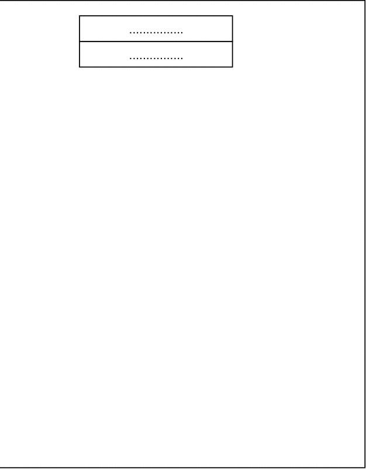
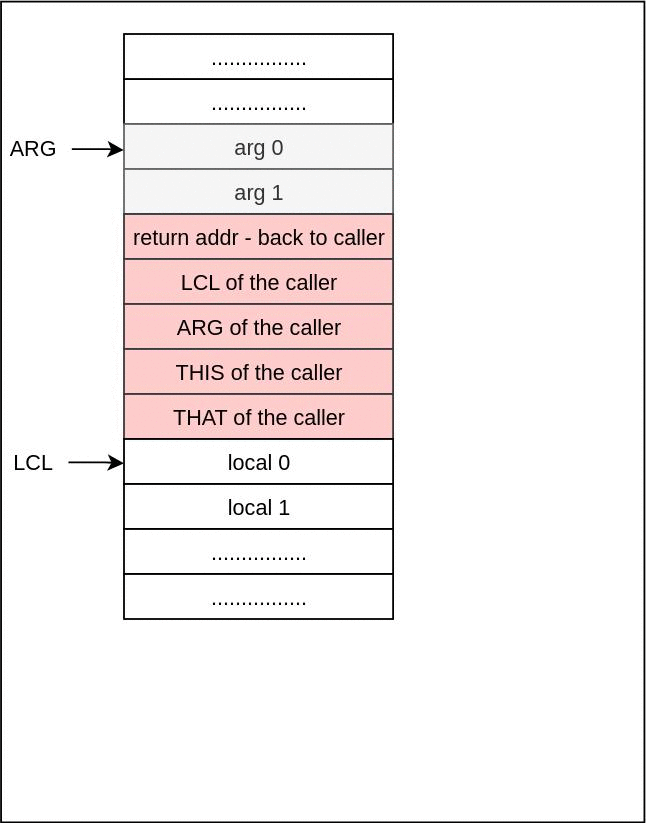

Python version: 3.11

## Implementation details

**Note**: this implementation of VM is different from the one proposed in the course, to be faster to write and easier to read. Though the main idea is the same, of course.<br>

Implementation of the VM is fairly straightforward, and boils down to **simply filling predefined templates** (in `const.py`) with the necessary values. That's all there is to it, really.<br>

**Optimisations**: assembly code is optimised to be short whenever possible. This is crucial because it's a bottleneck: if a VM instruction is translated into 10 assembly commands instead of optimal solution with, for example, 5 commands, then it will run 2x times slower than optimum - 10 clock cycles instead of 5.<br>

<br>

## Virtual Machine, memory segments and their meaning

See Readme file in the previous project - p07.

Arithmetic commands and memory access commands are already implemented. This project implements program flow commands commands and subroutine-related commands.

<br>

## Linking

Note that this VM compiler works a bit like a linker; not in the sense of including outside libraries, but in the sense of building one big executable (or, in this case, one big .asm file) from a multitude of .vm files in the directory.

<br>

## Frames

In this course the term **frame** is referred to the subroutine’s local variables, the arguments on which it operates, its working stack, and the other memory segments that support its operation. So, memory values of LCL, ARG, THIS and THAT are considered to be the function's frame; its "world".

Call to the function must save the caller's frame (values of LCL, ARG, THIS, and THAT just before the call) somewhere. In this course we **save the caller's world (frame) onto the stack itself**. Then, naturally, return from the function must **restore the caller's frame back from the stack**.


Frames logic is illustrated by the gif below. Suppose we have `main` function, which called function `a`, which in turn called function `b`.


For more detailed view, check `call` and `return` sections.

<br>

## Branching commands

**Label**<br>
Simply puts the specified label in the code.
* Assembly instructions count: 0. Only one pseudo-instruction.
* Optimizations: none.
* Implementation:
```
    ({fname_func}${label})
```
Why do we use the "fileName.funcName$label"? Because the same label, for example `LOOP_START`, can be present in several functions, and even in several files, which would break the program during linking step: all the `LOOP_START` labels will effectively lead to one and the same location in the code.

While the book proposes to use "functionName$label" convention, I think that it's better to include file name here, to allow defining the same function in several places: like `function MyFile.add` and `function AnotherFile.add`. Indeed, when we call those functions, we explicitly declare file name from which they are called, i.e. we use `call AnotherFile.add 2` instruction, and this allows us to distinguish between calls to two separate - but identically named - functions. 

In such cases, the "functionName$label" will not suffice, because if both versions of `add` create some label `START`, then `add$START` will be created twice, which is clearly not what we want.

<br>

**Goto**<br>
* Assembly instructions count: 2
* Optimizations: none.
* Implementation:
```
    @{fname_func}${label}
        0;JMP
```

<br>

**If-goto**<br>
* Assembly instructions count: 5
* Optimizations: SP is incremented without going to it twice.
* Implementation:
```
    @SP
    AM=M-1
    D=M                        D = RAM[SP - 1]
    @{fname_func}${label}
        D;JNE                  Jump if D is not False (0x0000)
```

## Subroutine commands

From the book: subroutine call and return commands must handle the following actions - 

1. Pass parameters from the caller to the called subroutine.
2. Save the state of the caller before switching to execute the called subroutine.
3. Allocate space for the local variables of the called subroutine.
4. Jump to execute the called subroutine.
5. Return values from the called subroutine back to the caller.
6. Recycle the memory space occupied by the called subroutine, when it returns.
7. Rebuild the state of the caller.
8. Jump to execute the code of the caller immediately following the spot where we left it.

<br>

**Call**<br>
Calling the function assumes that nArgs of its arguments were pushed onto the stack by the caller.

Call command has to handle the following tasks: 
1. Setting up a return address, so that execution may continue from this exact point.
2. Saving the caller's frame onto the stack.
3. Pointing `ARG` register to the first argument, and `LCL` register to the current `SP`.
4. Jumping to the function's address, so that it can be executed.

These tasks are illustrated by this gif:



<br>

* Assembly instructions count: 40
* Optimizations: delayed SP increment.
* Implementation:
```
    @{fname_func}_ret_addr__{cid}  1. Push return address. Note that SP is not incremented
    D=A                               in this push. Instead it will get incremented after
    @SP                               this command - from step 2 onwards. 
    A=M	                              This is done for optimisation reasons (this way less
    M=D                               assembly instructions are used).
    @LCL                           2. Push LCL
    D=M
    @SP
    AM=M+1
    M=D
    @ARG                           3. Push ARG
    D=M
    @SP
    AM=M+1
    M=D
    @THIS                          4. Push THIS
    D=M
    @SP
    AM=M+1
    M=D
    @THAT                          5. Push THAT
    D=M
    @SP
    AM=M+1
    M=D
    @{n}                           6. Set ARG = SP - n - 5
    D=A
    @5
    D=A+D
    @SP
    M=M+1                          <-- Here's that delayed SP increment.
    D=M-D
    @ARG
    M=D
    @SP                            7. Reposition LCL to SP
    D=M
    @LCL
    M=D
    @{fname_func}                  8. Goto myFile.myFoo
        0;JMP
    ({fname_func}_ret_addr__{cid})
```

<br>

What is `cid` used here? This stands for **call ID**. <br>
A call to function is unique, i.e. each call should get its unique mark to return to; otherwise, all calls to a given function would return to the same place and resume execution from the same line of code, which is clearly wrong. For that, we use the `cid` variable to distinguish between calls to the same function from completely different places in the code. We also use a file name, because a function can be called not only from different places in the same file, but from different files as well.

<br>

**Return**<br>

Return command has to restore the caller's frame from the stack, and to jump to return address in the caller's code.

So, this return command has to do the following actions:

1. Save the return address.
2. Reposition return value for the caller.
3. Restore SP, THAT, THIS, ARG and LCL of the caller.
4. Jump to return address.

These tasks are illustrated by this gif:



* Assembly instructions count: 43
* Optimizations: delayed SP increment.
* Implementation:
```
    @LCL                       1. FRAME = LCL
    D=M
    @13
    M=D
    @5                         2. RET = *(FRAME-5)
    D=D-A
    A=D
    D=M
    @14
    M=D
    @SP                        3. *ARG = pop()
    AM=M-1
    D=M
    @ARG
    A=M
    M=D
    @ARG                       4. SP = ARG + 1
    D=M+1
    @SP
    M=D
    @13                        5. THAT = *(FRAME-1)
    AM=M-1
    D=M
    @THAT
    M=D
    @13                        6. THIS = *(FRAME-2)
    AM=M-1
    D=M
    @THIS
    M=D
    @13                        7. ARG = *(FRAME-3)
    AM=M-1
    D=M
    @ARG
    M=D
    @13
    AM=M-1
    D=M
    @LCL
    M=D
    @14                        9. Goto RET
    A=M
    0;JMP
```

<br>

**Function**<br>

Function command is the simplest one out of subroutine-related commands. It just has to push zeroes `n` times, as `n` local variables. That's basically it.

* Assembly instructions count: dynamic.
* Optimizations: none
* Implementation with locals:
```
    ({fname_func})
        @SP
        A=M
    {init_zero_commands}
        @{n}
        D=A
        @SP
        M=M+D
```
* Implementation without locals:
```
    ({fname_func})
```