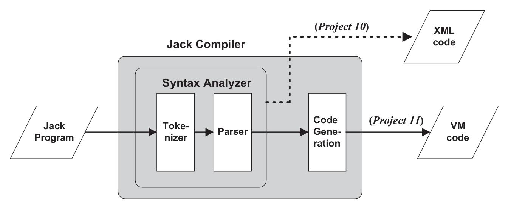
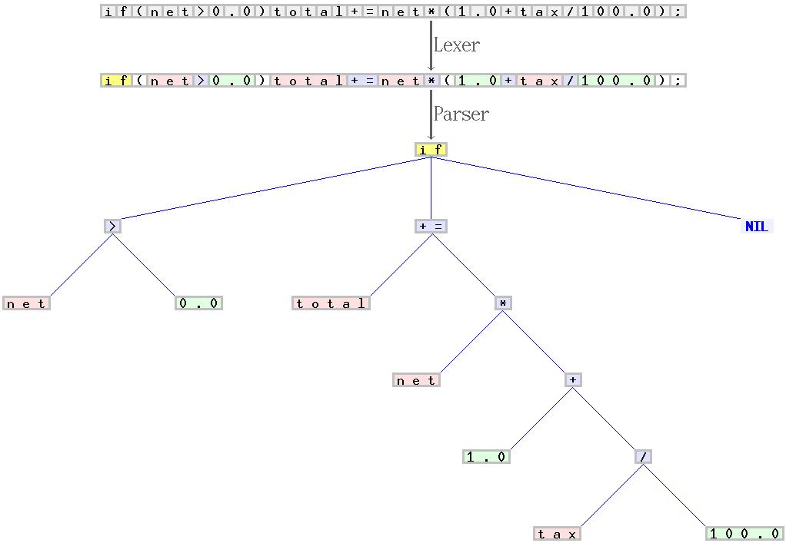

Python version: 3.11

## Implementation details

**Note**: this implementation of Jack compiler is different from the one proposed in the course, to be faster to write and easier to read. Though the main idea is the same, of course.<br>

<br><hr><br>

## Project structure

This project implements lexer and parser parts of the compiler. It focuses on **syntax analysis**, which means "understanding the structure of the program".




* `lexer.py` - another name for a tokenizer. "Scanner", "lexer", "tokenizer", "lexical analyzer" mean basically the same thing. Implementation is different from the book's proposed approach, as I used regular expressions and string manipulations to get the job done.
* `parser.py` - parser, which builds parse tree. In the book this is called "CompilationEngine", but since all it does is building a parse tree (i.e. it doesn't really do any compilation/optimizations) I called it "parser" instead of "compiler".<br>
It also follows the "lexer + parser" pair, like lex + yacc. Similarly, its methods are called `_parse_XXX` instead of `_compile_XXX`, but the essence is the same.
* `const.py` - holds various constants, regular expressions and templates for formatting.

<br><hr><br>

## Language elements

Jack language, like other programming languages, consists of basic elements.
* **Lexeme**: an instance of a token, in short. A lexeme is a sequence of characters in source code that matches the pattern for a token and is identified by the lexical analyzer as an instance of that token.<br>
Example: `if`, `[`, `class`, `.`, `,`, `foo`, etc.
* **Token**: is a string with an assigned and thus identified meaning.<br>
Example: "identifier", "keyword", "constant", "operator", etc.

<br><hr><br>

## Stages of compilation

The source code is just a plain text, readable for humans but unreadable for computers.

1. **Lexical analysis**: [source code -> tokens stream]<br>
This is the process of converting a sequence of characters (such as in a computer program or web page) into a sequence of lexical tokens (strings with an assigned and thus identified meaning)
2. **Syntatic analysis**: [(tokens stream, grammar) -> parse tree]<br>
This is formal analysis by a computer of a sentence or other string of words into its constituents, resulting in a parse tree showing their *syntactic relation* to each other,
3. **Semantic analysis**: the process of checking whether parse tree is semantically correct: for example, types of different variables match where it is required. Statement like `var int a; let a = Array.new(length);` may be syntactically correct, but semantically incorrect.<br>
This stage is not done in this project.
4. **Target code generation**: code in VM language is generated.

<br><hr><br>

## Grammar

Loosely speaking, a programming language's **grammar** is a set of rules that alows us to write valid statements and expresisons, and/or to check validity of statements and expressions given to us as input ("is statement X valid?" -> yes/no).

In Chomsky hierarchy, there are 4 types of grammars, and in this course we interact with **context-free grammar**. A context-free grammar (CFG) is a formal grammar whose production rules can be applied to a nonterminal symbol *regardless of its context*. This basically means that syntactic elements can be formed from simpler elements.

<br><hr><br>

## Statements and expressions

**Expression** is something that *evaluates to a value*, like `x+1`, `2+2` or `foo() + bar();`.

**Statement** is the smallest standalone element of an imperative programming language. A program is formed by a sequence of one or more statements. A statement will have internal components (e.g., expressions).
In Jack language statements are:
* `let` statement
* `if` statement
* `while` statement
* `do` statement
* `return` statement

<br><hr><br>

## Example of a parse tree

```
<class>
  <keyword> class </keyword>
  <identifier> Main </identifier>
  <symbol> { </symbol>
  <classVarDec>
    <keyword> static </keyword>
    <keyword> boolean </keyword>
    <identifier> test </identifier>
    <symbol> ; </symbol>
  </classVarDec>
  <subroutineDec>
    <keyword> function </keyword>
    <keyword> void </keyword>
    <identifier> main </identifier>
    <symbol> ( </symbol>
    <parameterList>
    </parameterList>
    <symbol> ) </symbol>
    <subroutineBody>
      <symbol> { </symbol>
      <varDec>
        <keyword> var </keyword>
        <identifier> SquareGame </identifier>
        <identifier> game </identifier>
        <symbol> ; </symbol>
      </varDec>
      <statements>
        <letStatement>
          <keyword> let </keyword>
          <identifier> game </identifier>
          <symbol> = </symbol>
          <expression>
            <term>
              <identifier> SquareGame </identifier>
              <symbol> . </symbol>
              <identifier> new </identifier>
              <symbol> ( </symbol>
              <expressionList>
              </expressionList>
              <symbol> ) </symbol>
            </term>
          </expression>
          <symbol> ; </symbol>
        </letStatement>
        <doStatement>
          <keyword> do </keyword>
          <identifier> game </identifier>
          <symbol> . </symbol>
          <identifier> run </identifier>
          <symbol> ( </symbol>
          <expressionList>
          </expressionList>
          <symbol> ) </symbol>
          <symbol> ; </symbol>
        </doStatement>
        <doStatement>
          <keyword> do </keyword>
          <identifier> game </identifier>
          <symbol> . </symbol>
          <identifier> dispose </identifier>
          <symbol> ( </symbol>
          <expressionList>
          </expressionList>
          <symbol> ) </symbol>
          <symbol> ; </symbol>
        </doStatement>
        <returnStatement>
          <keyword> return </keyword>
          <symbol> ; </symbol>
        </returnStatement>
      </statements>
      <symbol> } </symbol>
    </subroutineBody>
  </subroutineDec>
  <subroutineDec>
    <keyword> function </keyword>
    <keyword> void </keyword>
    <identifier> more </identifier>
    <symbol> ( </symbol>
    <parameterList>
    </parameterList>
    <symbol> ) </symbol>
    <subroutineBody>
      <symbol> { </symbol>
      <varDec>
        <keyword> var </keyword>
        <keyword> int </keyword>
        <identifier> i </identifier>
        <symbol> , </symbol>
        <identifier> j </identifier>
        <symbol> ; </symbol>
      </varDec>
      <varDec>
        <keyword> var </keyword>
        <identifier> String </identifier>
        <identifier> s </identifier>
        <symbol> ; </symbol>
      </varDec>
      <varDec>
        <keyword> var </keyword>
        <identifier> Array </identifier>
        <identifier> a </identifier>
        <symbol> ; </symbol>
      </varDec>
      <statements>
        <ifStatement>
          <keyword> if </keyword>
          <symbol> ( </symbol>
          <expression>
            <term>
              <keyword> false </keyword>
            </term>
          </expression>
          <symbol> ) </symbol>
          <symbol> { </symbol>
          <statements>
            <letStatement>
              <keyword> let </keyword>
              <identifier> s </identifier>
              <symbol> = </symbol>
              <expression>
                <term>
                  <stringConstant> string constant </stringConstant>
                </term>
              </expression>
              <symbol> ; </symbol>
            </letStatement>
            <letStatement>
              <keyword> let </keyword>
              <identifier> s </identifier>
              <symbol> = </symbol>
              <expression>
                <term>
                  <keyword> null </keyword>
                </term>
              </expression>
              <symbol> ; </symbol>
            </letStatement>
            <letStatement>
              <keyword> let </keyword>
              <identifier> a </identifier>
              <symbol> [ </symbol>
              <expression>
                <term>
                  <integerConstant> 1 </integerConstant>
                </term>
              </expression>
              <symbol> ] </symbol>
              <symbol> = </symbol>
              <expression>
                <term>
                  <identifier> a </identifier>
                  <symbol> [ </symbol>
                  <expression>
                    <term>
                      <integerConstant> 2 </integerConstant>
                    </term>
                  </expression>
                  <symbol> ] </symbol>
                </term>
              </expression>
              <symbol> ; </symbol>
            </letStatement>
          </statements>
          <symbol> } </symbol>
          <keyword> else </keyword>
          <symbol> { </symbol>
          <statements>
            <letStatement>
              <keyword> let </keyword>
              <identifier> i </identifier>
              <symbol> = </symbol>
              <expression>
                <term>
                  <identifier> i </identifier>
                </term>
                <symbol> * </symbol>
                <term>
                  <symbol> ( </symbol>
                  <expression>
                    <term>
                      <symbol> - </symbol>
                      <term>
                        <identifier> j </identifier>
                      </term>
                    </term>
                  </expression>
                  <symbol> ) </symbol>
                </term>
              </expression>
              <symbol> ; </symbol>
            </letStatement>
            <letStatement>
              <keyword> let </keyword>
              <identifier> j </identifier>
              <symbol> = </symbol>
              <expression>
                <term>
                  <identifier> j </identifier>
                </term>
                <symbol> / </symbol>
                <term>
                  <symbol> ( </symbol>
                  <expression>
                    <term>
                      <symbol> - </symbol>
                      <term>
                        <integerConstant> 2 </integerConstant>
                      </term>
                    </term>
                  </expression>
                  <symbol> ) </symbol>
                </term>
              </expression>
              <symbol> ; </symbol>
            </letStatement>
            <letStatement>
              <keyword> let </keyword>
              <identifier> i </identifier>
              <symbol> = </symbol>
              <expression>
                <term>
                  <identifier> i </identifier>
                </term>
                <symbol> | </symbol>
                <term>
                  <identifier> j </identifier>
                </term>
              </expression>
              <symbol> ; </symbol>
            </letStatement>
          </statements>
          <symbol> } </symbol>
        </ifStatement>
        <returnStatement>
          <keyword> return </keyword>
          <symbol> ; </symbol>
        </returnStatement>
      </statements>
      <symbol> } </symbol>
    </subroutineBody>
  </subroutineDec>
  <symbol> } </symbol>
</class>
```